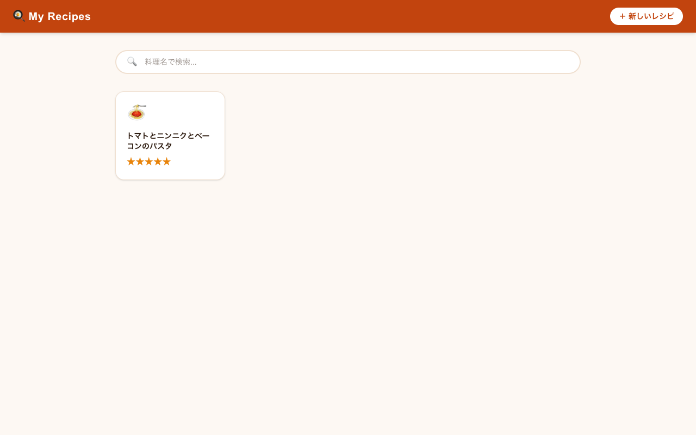
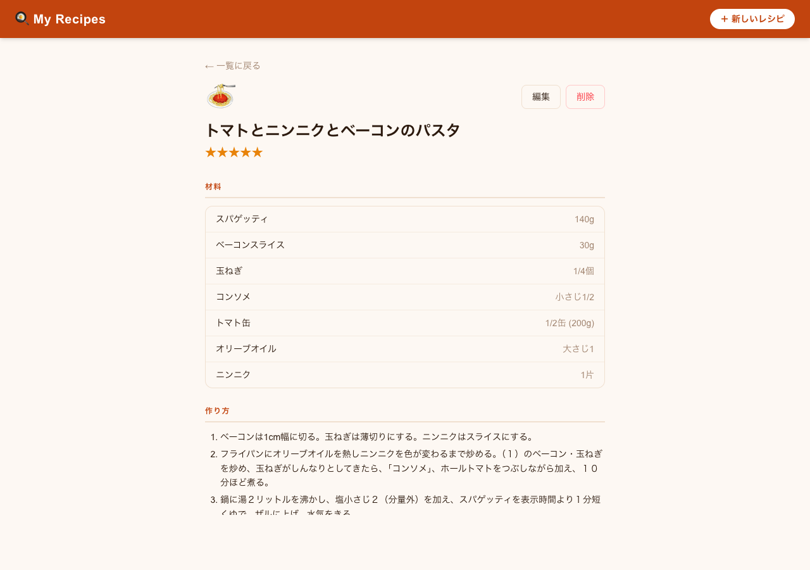

# My Recipes

日々の自炊レシピを記録・参照するための個人用ローカル Web アプリ。



## 機能

- レシピの追加・編集・削除
- 料理名でのリアルタイム検索
- 作った日の新しい順にグリッド表示
- アイコン（絵文字）をピッカーで選択（未設定時は自動アサイン）
- 材料の名前・量を管理（ドラッグ&ドロップで並び替え可）
- 作り方の Markdown 記述対応
- 評価（★1〜5）・参考 URL・メモの記録
- 作った日は任意入力



## 技術スタック

| | |
|---|---|
| フレームワーク | [Next.js 16](https://nextjs.org) (App Router) |
| DB | [Drizzle ORM](https://orm.drizzle.team) + SQLite (`better-sqlite3`) |
| スタイル | [Tailwind CSS v4](https://tailwindcss.com) |
| プロセス管理 | [PM2](https://pm2.keymetrics.io) |

## 動作環境

- **Node.js**: 22.x
- **OS**: macOS（PM2 の自動起動手順は macOS 前提）

## 初回セットアップ

```bash
npm install
npm run db-push   # recipes.db を生成
```

## 起動方法

### 開発時（ホットリロードあり）

```bash
make dev
```

`http://localhost:3939` にアクセス。

### 常駐起動（PM2）

PM2 を使ってバックグラウンドで常駐させる。Mac ログイン時に自動起動される。

```bash
# 初回のみ
npm install -g pm2
make deploy
pm2 save
pm2 startup   # 表示されたコマンドを sudo で実行
```

## よく使うコマンド

```bash
make dev        # 開発サーバー起動
make deploy     # ビルド → PM2 再起動（本番反映）
make restart    # ビルドなしで PM2 再起動
make stop       # サーバー停止
make logs       # PM2 ログ表示
make db-push    # スキーマ変更を DB に反映
```

## スキーマ変更後の手順

`src/db/schema.ts` を変更した場合：

```bash
make db-push
make deploy
```

## データ

レシピデータは `recipes.db`（SQLite ファイル）にローカル保存される。
バックアップは手動でファイルをコピーすること。

```bash
cp recipes.db recipes.db.bak
```

## ライセンス

[MIT](LICENSE)
